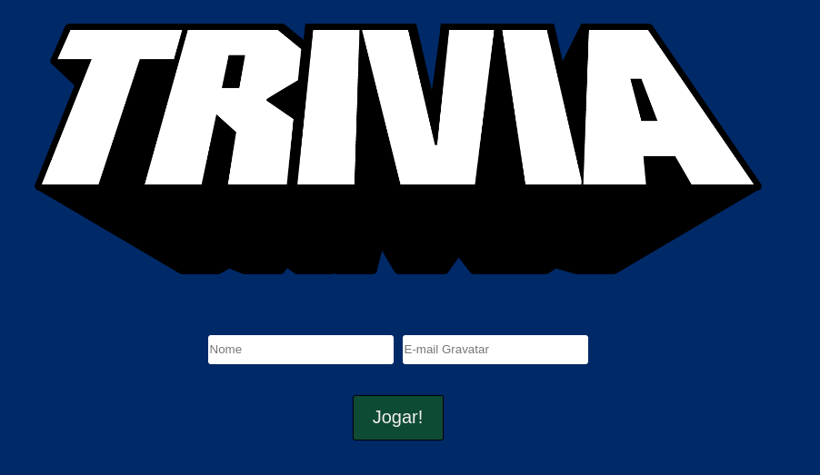

# Trivia

This project was developed during the web development course at [Trybe](https://www.betrybe.com/). It was developed by a team formed by
[Pedro Fonseca](https://github.com/PedroFonseca13),
[Jorge Dorio](https://github.com/JorgeDorio),
[Tadeo Salaviaw](https://github.com/SALAVIAW), and myself.
The project is a Trivia game. We used the free API [Open Trivia Database](https://opentdb.com/)
to feed our front end project. The main goal here was to put in practice what we had learned of React and Redux.



## Installation

Clone this repository
```bash
git clone git@github.com:VitorCorrea18/project-trivia.git
```
In the project's folder install the dependencies
```bash
npm install
```
Start the project
```bash
npm start
```

- <b>Now it should be running on your default browser</b>

## How to play

* <b>Login</b> <br>
> You must enter your name and e-mail then click 'Jogar' button. If you have a gravatar registred e-mail you should see your avatar once you start the game.

* <b>Game</b> <br>
> - Once the game starts you will will be given 5 questions from a variety of topics (<b>Geography, History, Movies, Games, etc...</b>). <br>
> - Be aware of the time limit to answer, each question will give you 30 seconds. Once you answer or if the time is up
you will see a button 'Next' to see the next question.
> - Each correct answer will give a score based on the difficulty of the question.
> - At the end of the game the total score and feedback can the seen, you can play again by clicking on the 'Play Again' button.
 - <b> Enjoy the game :smile: </b>

<b>Feedbacks are welcome :rocket:</b>
